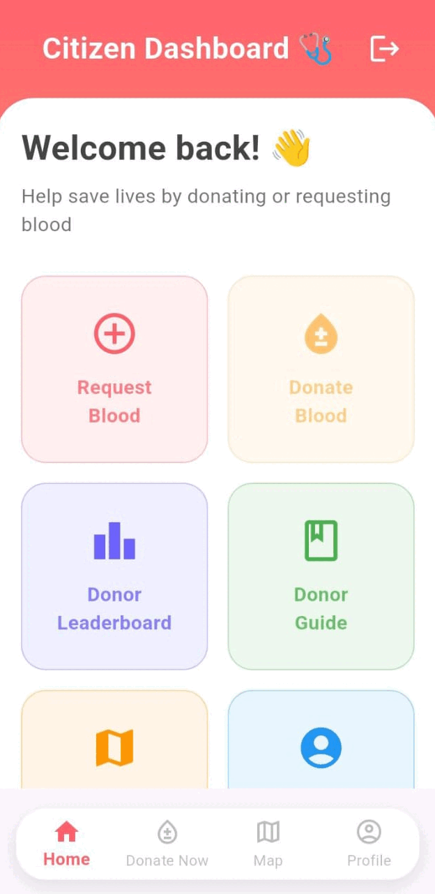
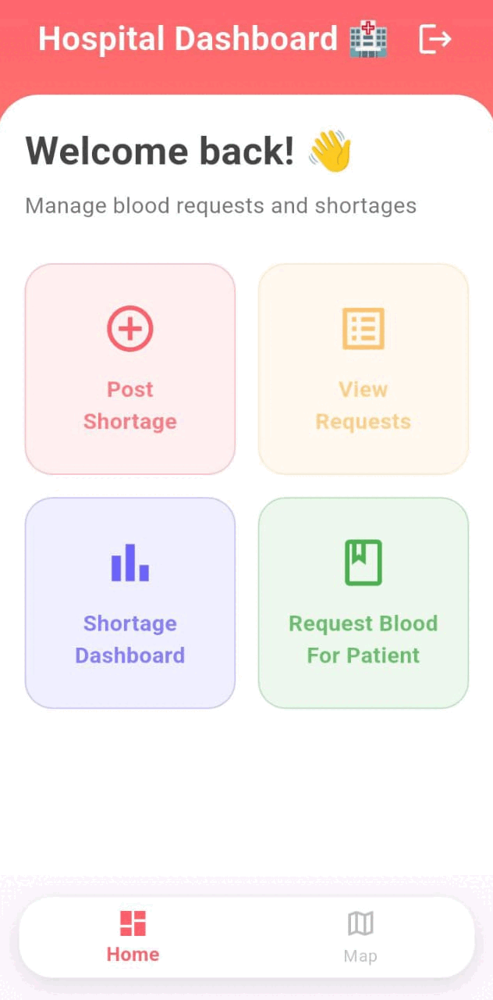
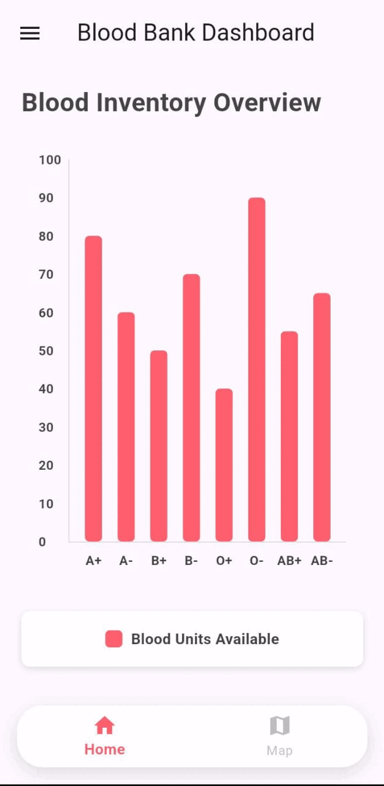

# 🌟 OneDrop - Connecting Blood Donors & Hospitals 🩸

Welcome to **OneDrop**, an innovative Flutter-based mobile app designed to bridge the gap between **blood donors** and **hospitals** in emergencies. 🚑 Our goal is to make the blood donation process **faster, smarter, and more accessible**.

## 🎥 App Preview

| Citizen Features 🏥 | Hospital Features 🏨 | Blood Bank Features 🏦 |
|---------------------|---------------------|----------------------|
|  |  |  |

---

## 🔥 Features

✅ **User Authentication** (Firebase Auth)
✅ **Real-time Donor Availability** (Firestore Integration)
✅ **Hospital Dashboard** 🏥
✅ **Leaderboard for Top Donors** 🏆
✅ **Secure & Optimized Performance** 🚀
✅ **Dark Mode & Smooth UI** 🎨
✅ **Instant Notifications** 📢

---

## ⚙️ Tech Stack

- **Frontend:** Flutter 🐦
- **Backend:** Firebase 🔥 (Auth, Firestore, Cloud Functions)
- **State Management:** Provider & Riverpod
- **Maps & Location Services:** Google Maps API 📍
- **Design:** Material UI 🎨

---

## 📲 Installation

Follow these simple steps to run the project locally:

```bash
# Clone the repo
git clone https://github.com/akhil-varsh/onedrop.git

# Navigate to the project directory
cd onedrop

# Install dependencies
flutter pub get

# Run the app
flutter run
```

**Make sure you have Flutter and Firebase configured!** ⚡

---

## 🎯 Roadmap

🔹 Add AI-powered blood donation predictions 🤖
🔹 Implement a reward-based donation system 🎁
🔹 Enhance hospital-donor communication 📞

---

## 🤝 Contributing

We welcome contributions! 🛠️ If you’d like to contribute:
1. Fork the repository 🍴
2. Create a new branch (`git checkout -b feature-branch`)
3. Commit changes (`git commit -m 'Added new feature'`)
4. Push the branch (`git push origin feature-branch`)
5. Create a Pull Request 🚀

---

## 📜 License

This project is licensed under the **MIT License**. Feel free to use and modify! 🎉

---

### 📧 Contact
For questions or suggestions, reach out at: **akvarsh1013@gmail.com** 📩

Let’s save lives together! ❤️🩸

---

<p align="center">
  Made with ❤️ by Akhil
</p>
